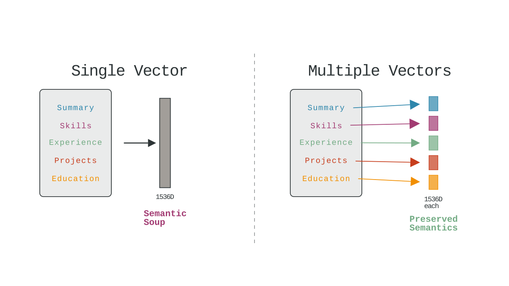

# Vector search architecture

## Why multiple vectors per resume

When I first started building this resume search system, I did what seemed obvious - take each resume, convert it to a single vector, 
store it, and search against it. Simple and clean, right? Well, it turned out to be a disaster.

The thing is, resumes are these incredibly complex documents. They're not like product descriptions or tweets where you have one main idea. 
A resume has a professional summary that talks about multiple things simultaneously (summary, experience), 
then suddenly pivots to listing Python and Kubernetes, then describes a job where someone built payment systems, 
and another where they managed a team. 
When I tried to squeeze all of that into a single embedding vector, I got this meaningless average that didn't really capture anything well.

  
   
  <small style="color: #666; font-size: 0.9em;">Single vector approach (left) averages everything into semantic soup, while multiple vectors (right) preserve distinct semantic meanings for each resume section</small>

I remember testing it with a search for "Python microservices architecture" and getting terrible results. 
A resume that mentioned `Python` once in the skills section and had five years of Java microservices experience would rank the same as someone 
who'd been building Python microservices for their entire career. The single vector just mushed everything together into semantic soup.

## How I'm handling it now

So I completely changed the approach. Now when a resume comes in, I break it apart into meaningful chunks, 
and each chunk gets its own vector. The professional summary becomes one vector. Each skill gets its own vector. 
Every single bullet point under work experience gets vectorized separately. Same thing for projects, education, certifications - everything.

A typical resume (1 page, [Jake's Template](https://www.overleaf.com/latex/templates/jakes-resume/syzfjbzwjncs) format) ends up as somewhere between 15 and 30 vectors in Qdrant. 
At first I worried this was overkill, but it solved so many problems. When someone searches for "Python microservices", 
system can now find resumes where Python appears in one job and microservices appears in a completely different role. 
The person clearly has both skills, but they might not have used them together yet. 

_The old single-vector approach would have completely missed this candidate._

The chunking strategy isn't random either. I preserve semantic boundaries - a complete job description stays together, 
a project description stays intact. I'm not just splitting on word count or anything crude like that. 
This maintains the contextual meaning while working within the embedding model's token limits.

## The search flow

When a search query comes in, I convert it to a vector using the same embedding model, then search against all vectors in Qdrant. 
This returns a bunch of hits, and often I'll get multiple hits from the same resume. 
Someone searching for "React TypeScript" might match against a skills section, a job description, and a project description all from the same person.

This is where the grouping logic comes in. I collect all the matches from the same resume and present them together. 
This serves two purposes - it prevents the same resume from appearing multiple times in the search results (which would be super annoying), 
and it lets me show users exactly why each resume matched. They can see the specific excerpts that matched their query, which builds trust in the search results.

The ranking gets a bit tricky when some resumes have many matches and others have few. 
I use a combination of the best match score and the number of matches to determine the final ranking. It's not perfect, but it works reasonably well.

## Storage and performance considerations

Yes, way more data is being stored now. A resume that would have been one 384-dimensional vector is now 20 or more vectors. 
But here's the thing - vectors are tiny. Each one is about 1.5KB. So even with 20 vectors per resume, we're talking about 30KB. 
The original PDF is probably 500KB or more. In the grand scheme of things, this is nothing.

I was initially worried about search performance with millions of vectors, but Qdrant has been incredible. 
It uses [HNSW indexing](https://en.wikipedia.org/wiki/Hierarchical_navigable_small_world) which keeps search times in the low milliseconds even at scale. 
I've load tested with 1,000 resumes (which translates to about 0.1 million vectors) and searches still return in under 50ms. 

[!NOTE] The bottleneck is actually the language model API calls for query understanding, not the vector search itself. For example,
using OpenAI API, search request takes about 300-400ms, where at least half of time needed - back-and-forth with sending and getting 
responses from remote server.

## The embedding process

The embedding model I'm using is OpenAI's `text-embedding-3-small`. It's got an 8191 token limit, which is actually quite generous compared to older models. 
You'd think this would mean I could embed entire resumes at once, but here's the thing - even with that much context, cramming a whole resume into one vector 
still produces that same semantic soup problem I mentioned earlier. Plus, a really detailed resume can still exceed 8191 tokens when you count everything up.

So I stick with the chunking approach, but the nice thing about `text-embedding-3-small` is I never have to worry about individual chunks getting cut off. 
A job description or a project summary pretty much always fits comfortably within the token limit. The model produces 1536-dimensional vectors, 
which hit a sweet spot between capturing semantic meaning and keeping storage reasonable. 
I experimented with the larger text-embedding-3-large model that can go up to 3072 dimensions, but honestly, 
the improvements weren't worth doubling the storage and slowing down the searches.

The actual implementation lives in the EmbeddingService. It's set up to handle batch operations efficiently - I can send up to 64 text chunks to OpenAI's API in a single request. 
When a resume gets processed, the ProcessingService extracts all the text chunks with their metadata, then sends them to the EmbeddingService in batches. 
Each chunk knows where it came from - whether it's a skill, an employment bullet point, an education detail. 
If it's from employment, it also knows which job and company it's associated with. All this metadata travels with the vector into Qdrant.

One thing I've noticed is that OpenAI's embeddings are incredibly stable. The same text always produces the exact same vector, which is great for caching and deduplication. 
And the API is fast - even with batching, I can process a full resume's worth of chunks in under a second. 
The circuit breaker I've got in place rarely trips because the service is so reliable.

## Trade-offs and things I considered

I looked at a bunch of alternatives before settling on this approach. I could have used **a larger embedding model with a bigger context window**, 
maybe one that could handle 2000 or 4000 tokens. But those models are significantly slower and more expensive to run. 
When you're processing thousands of resumes, those costs add up fast.

I also considered creating **specialized embeddings for different search types**. Like having one set of vectors optimized for skills search, 
another for experience search, another for education. But that would have tripled or quadrupled my storage needs, and made the search logic much more complex.

Another approach would have been **hierarchical embeddings** - create chunk embeddings, then use those to create section embeddings, 
then combine those into a document embedding. Very elegant in theory, but in practice it was slow and didn't improve search quality enough to justify the complexity.

## What's not perfect

The current approach has its downsides. The code is definitely more complex than the single-vector version. 
The grouping and ranking logic adds a layer that wouldn't exist otherwise. 
Debugging search results is harder because you have to trace through multiple vector matches instead of just one.

There's also the issue of **semantic drift**. When I chunk a resume, each chunk loses some context. 
A bullet point about "reducing latency" loses the context that it was for a Python backend role. 
I try to mitigate this by including job titles and companies in the metadata, but it's not perfect.

## Future ideas I'm exploring

I'm thinking about adding a document-level vector that captures the overall resume gestalt. 

This would run alongside the chunk vectors for hybrid scoring. It _might_ help with those holistic queries like "senior engineering leader" 
where the seniority is implied across multiple sections rather than stated explicitly.

I'm also investigating smarter chunking strategies. 

Right now I chunk by resume section, but I could potentially chunk by **semantic similarity** - keeping related concepts together even if they appear in different parts of the resume. 
Like if someone mentions Docker in their skills and then has three different jobs where they used Docker, maybe those should be connected somehow.

Another interesting possibility is **weighted vectors** based on recency and relevance. 
A skill mentioned in someone's current job is probably more relevant than the same skill in a job from five years ago. 
Qdrant supports custom scoring functions that could enable this kind of temporal weighting.

## Why this architecture matters

At the end of the day, this whole multi-vector approach is about search quality. 

_Recruiters and hiring managers don't want to wade through hundreds of resumes. They want to find the five or ten people who are genuinely good matches for their role._

By preserving the semantic meaning of different resume sections and searching across all of them independently, 
I can surface candidates that simpler approaches would miss. The person who used Python at one job and microservices at another. 
The developer who has the right skills but describes them differently than the search query. 
The senior engineer whose leadership experience is scattered across multiple roles.

It's more complex than I initially wanted, but the results speak for themselves. 
Search quality is dramatically better, users find what they're looking for, and the system is flexible enough to evolve 
as I learn more about how people actually search for candidates. That flexibility and quality is worth every bit of added complexity.